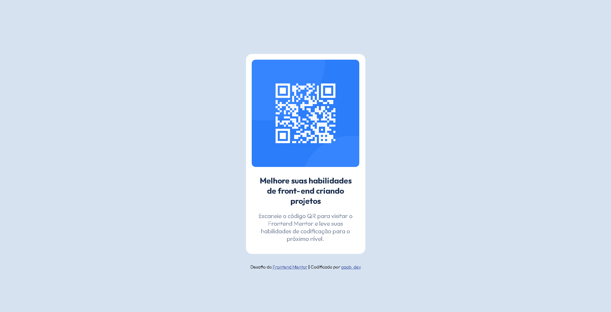

## Visão geral
Esta é uma solução para o [desafio do componente de código QR no Frontend Mentor](https://www.frontendmentor.io/challenges/qr-code-component-iux_sIO_H).

### Preview

    

### Links
- URL do site ao vivo: [Adicione URL do site ao vivo aqui](https://your-live-site-url.com)

### Tecnologias
- HTML5
- CSS
- Flexbox
- Git e Github

## Autor
- Frontend Mentor - [@gabyzinha72](https://www.frontendmentor.io/profile/gabyzinha72)